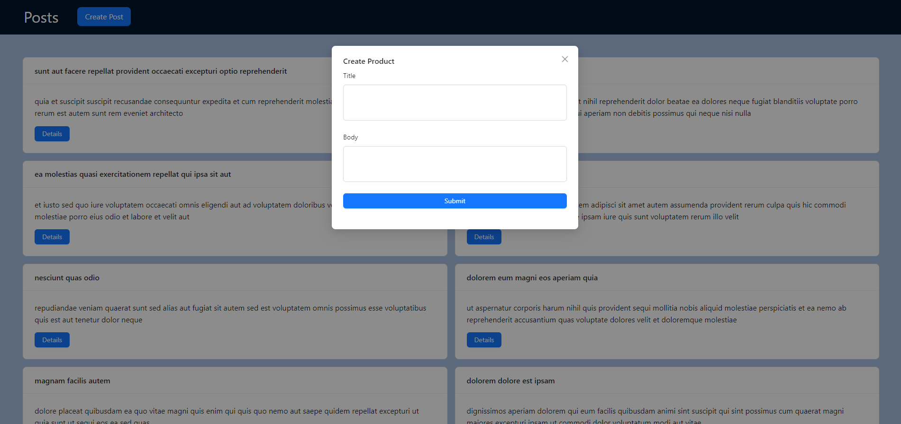
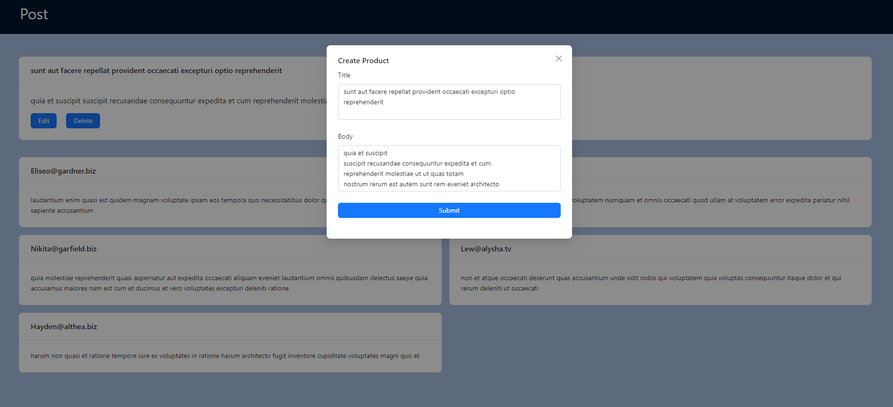

# React + TypeScript + Vite

This template provides a minimal setup to get React working in Vite with HMR and some ESLint rules.

Currently, two official plugins are available:

- [@vitejs/plugin-react](https://github.com/vitejs/vite-plugin-react/blob/main/packages/plugin-react/README.md) uses [Babel](https://babeljs.io/) for Fast Refresh
- [@vitejs/plugin-react-swc](https://github.com/vitejs/vite-plugin-react-swc) uses [SWC](https://swc.rs/) for Fast Refresh

## Available Scripts

In the project directory, you can run:

### `npm run dev`

Runs the app in the development mode.\
Open [http://localhost:5173](http://localhost:5173) to view it in the browser.

The page will reload if you make edits.\
You will also see any lint errors in the console.

### `Photo`

   Users page.
  

  
  

    Posts page.
  

  
  

      Post page.
  

  
   

   Create Post.
  

  
  

   Edit Post.
  

  

